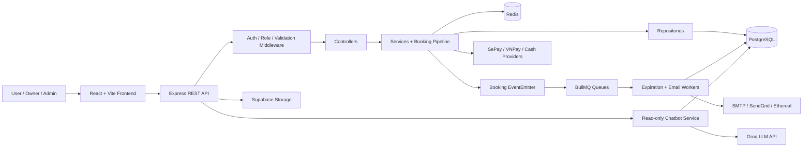

# FieldNow Architecture Notes

## 1. Kiến Trúc Tổng Quan

FieldNow là hệ thống đặt sân thể thao theo kiến trúc **client-server modular
monolith**. Frontend là ứng dụng React/Vite, backend là một ứng dụng Express duy
nhất nhưng được chia module rõ theo layer và domain. Dữ liệu nghiệp vụ chính nằm
trong PostgreSQL, ảnh sân nằm trong Supabase Storage, Redis hỗ trợ booking
lock/cache/BullMQ, BullMQ xử lý các side effect bất đồng bộ, và AI chatbot
read-only hỗ trợ hỏi đáp theo dữ liệu đã được backend allowlist.



## 2. Architecture Style

Kiến trúc chính của FieldNow là **module-based modular monolith**.
Hệ thống chưa tách microservices vì scope hiện tại phù hợp hơn với một backend
duy nhất: dễ test, dễ debug, giảm overhead deployment và vẫn giữ được domain
boundary rõ. Bên trong mỗi module vẫn giữ các layer nhỏ như route, controller,
service, repository và validator để code dễ đọc, nhưng file được gom theo
nghiệp vụ thay vì tách ngang toàn repo.

Layer backend:

| Layer | Trách nhiệm | File / folder chính |
| --- | --- | --- |
| Route registry | Mount public API paths | `BE/src/routes/index.js` |
| Domain module | Gom route/controller/service/repository/validator theo nghiệp vụ | `BE/src/modules/*` |
| Middleware | Auth, role, validation, rate limit, error handling | `BE/src/common/middlewares` |
| Controller | Đọc request, gọi service, trả response envelope | `BE/src/modules/*/*.controller.js` |
| Service | Điều phối business use case | `BE/src/modules/*/*.service.js` |
| Pipeline | Chia booking creation thành các step độc lập | `BE/src/modules/bookings/pipeline` |
| Repository | Đóng gói Prisma/database access | `BE/src/modules/*/*.repository.js` |
| Provider | Đóng gói tích hợp thanh toán/storage | `BE/src/modules/payments/providers`, `BE/src/infrastructure` |
| AI context/client | Phân loại intent, gom context an toàn, gọi Groq | `BE/src/modules/chatbot`, `BE/src/infrastructure/groq.client.js` |
| Worker/listener | Xử lý side effect bất đồng bộ | `BE/src/jobs`, `BE/src/modules/bookings/booking.listener.js` |

## 3. Core Runtime Flows

### Booking Flow

```text
POST /api/v1/bookings
  -> auth middleware
  -> Zod booking validation
  -> booking controller
  -> booking service
  -> ValidateSlotStep
  -> AcquireLockStep
  -> CheckAvailabilityStep
  -> CreateBookingStep
  -> EmitEventStep
  -> booking event listener
  -> BullMQ expiration job
```

Booking có invariant quan trọng: một sân không được có booking active bị overlap
trong cùng ngày. Hệ thống bảo vệ invariant này bằng 2 lớp:

- Redis lock với `SET NX PX` để giảm race condition khi nhiều user đặt cùng
  sân/ngày.
- PostgreSQL GIST exclusion constraint `Booking_no_active_overlap` là source of
  truth cuối cùng, chặn overlap với status `PENDING` hoặc `CONFIRMED`.

### Owner Scheduling Flow

```text
Owner UI
  -> manual slot / quick daily slots / recurring slots
  -> POST /api/v1/owner/fields/:fieldId/slots/batch
  -> owner auth + role middleware
  -> slot controller
  -> slot service validates ownership, time range, overlap
  -> slot repository
  -> FieldSlot rows
```

Manual, quick và recurring scheduling dùng cùng một batch slot API. Frontend là
nơi generate recurring slots và chia batch; backend chỉ validate và ghi các
`FieldSlot` row. Slot bị khóa bằng `FieldSlot.is_locked`; booking creation sẽ
reject khung giờ trùng với slot đang locked.

### Payment and Expiration Flow

Online payment giữ booking ở `PENDING` cho đến khi SePay IPN/callback xác nhận
thành công. Khi thành công, payment chuyển `COMPLETED` và booking chuyển
`CONFIRMED`. Nếu thanh toán thất bại, payment chuyển `FAILED` nhưng booking vẫn
`PENDING` để user có thể retry trước khi hết hạn.

BullMQ tạo delayed job 15 phút cho booking online. Nếu hết hạn mà booking vẫn
`PENDING`, worker chuyển booking sang `CANCELLED` và payment pending sang
`EXPIRED`. Cron cleanup là fallback nếu delayed job bị miss. Cash payment là
trường hợp sync: booking được confirm ngay, expiration job được remove và email
confirm được đưa vào queue.

### Read-only AI Chatbot Flow

Chatbot là flow sync read-only. LLM không query database trực tiếp. Backend nhận
message, xác định scope theo role, gọi các context provider được allowlist,
sanitize dữ liệu, rồi gửi JSON context sang Groq để diễn đạt câu trả lời.

```text
POST /api/v1/chatbot/message
  -> chatbot rate limit
  -> optional auth middleware
  -> chatbot controller
  -> chatbot service classify intent + role scope
  -> chatbot context service reads allowed DB data
  -> deterministic guards for count/revenue/payment facts
  -> Groq client via native fetch
  -> response answer + suggestedActions + sources
```

Role scope hiện tại:

- Guest: hỏi chính sách chung, tìm sân public, lịch trống public ở mức không cá nhân.
- User: xem booking/payment của chính mình.
- Owner: xem sân, slot, booking, cash payment và doanh thu của sân thuộc owner.
- Admin: xem aggregate toàn hệ thống như user count, field count, booking/payment
  status và doanh thu tháng này.

Guardrail chính: chatbot không tạo/sửa/hủy booking, không xác nhận thanh toán,
không lộ secret/system prompt/raw SQL, và không trả dữ liệu ngoài quyền.

## 4. Architecture Characteristics

Bảng dưới đây gom các characteristics thường gặp khi review kiến trúc. Cột
`Trạng thái` nói rõ hệ thống đã có, có một phần, hay chưa có.

| Characteristic | Trạng thái | Hệ thống có được / không có vì đâu |
| --- | --- | --- |
| Maintainability | Có | Backend gom code theo domain module, mỗi module chứa route/controller/service/repository/validator của nghiệp vụ đó nên dễ đọc và dễ sửa theo use case. |
| Modifiability | Có | Payment provider dùng factory/strategy, booking flow dùng pipeline nên có thể thêm step/provider mà ít ảnh hưởng phần còn lại. |
| Simplicity | Có | Modular monolith giữ runtime đơn giản hơn microservices, phù hợp scope môn học và demo. |
| Testability | Có | Jest/Supertest, repository/service boundaries, exported worker functions và Prisma validation giúp test unit/integration. |
| Data integrity | Có | PostgreSQL foreign key, unique indexes, transaction và `Booking_no_active_overlap` bảo vệ booking overlap. |
| Consistency | Có cho core booking | Booking/payment state update trong transaction; Redis lock chỉ là contention control, DB mới là final guard. |
| Interoperability | Có | REST API, JSON response envelope, SePay/VNPay providers, Supabase Storage SDK, SMTP/email provider. |
| Cost efficiency | Có một phần | Monolith, managed Postgres/Redis và static FE giúp giảm chi phí demo; chưa có phân tích cost production. |
| Security | Có một phần | JWT auth, role middleware, bcrypt, Helmet, CORS theo env, rate limit cho search/OTP/password/chatbot. Chatbot dùng optional auth + role-scoped context, không cho LLM query DB trực tiếp. Chưa có audit log đầy đủ hay permission model phức tạp. |
| Performance | Có một phần | Redis cache, PostgreSQL full-text search + GIN index, pagination, compression, async email/expiration. Chatbot dùng context giới hạn `CHATBOT_MAX_CONTEXT_DOCS`, deterministic answer cho số liệu để giảm phụ thuộc LLM. Spike latency và LLM latency vẫn là điểm cần tối ưu thêm. |
| Scalability | Có một phần | FE static và BE stateless tương đối dễ scale theo instance; nhưng monolith và in-process listener cần cẩn thận khi scale nhiều instance, Redis/DB là shared dependency. |
| Reliability | Có một phần | DB constraint, worker retry, cron fallback, idempotent payment callback và graceful shutdown. Chưa có multi-region/failover đầy đủ. |
| Recoverability | Có một phần | Cron cleanup sửa một phần missed delayed jobs; chưa có backup/restore runbook trong repo. |
| Availability | Có một phần | `/health`, `/ready`, Docker healthcheck và external Redis/PostgreSQL hỗ trợ vận hành. Chưa có active-active deployment hay self-healing hoàn chỉnh trong repo. |
| Resilience | Có một phần | Cache errors được ignore để không làm fail request; Redis lock unavailable thì fallback vào DB overlap guard; BullMQ có retry/backoff. |
| Observability | Có một phần | Pino structured logging, request id, worker logs, health/readiness endpoints. Chưa có metrics dashboard/tracing/alerting. |
| Deployability | Có một phần | Docker, Docker Compose, GitHub Actions cho BE, Prisma migrate deploy. FE deploy riêng và env management vẫn cần cấu hình ngoài repo. |
| Portability | Có một phần | Docker Compose chạy local với Postgres/Redis; Supabase Storage, SePay và cloud env làm hệ thống vẫn phụ thuộc provider. |
| Usability | Có một phần | FE có public/user/owner/admin flows, protected routes, normalized API responses. Chưa có đánh giá accessibility chính thức. |
| Auditability | Chưa rõ | Hệ thống có log request/worker nhưng chưa có audit trail riêng cho admin/owner actions. |
| Elasticity | Chưa có | Chưa có autoscaling policy, queue autoscaling hay benchmark trên production/staging. |
| High availability | Chưa có | Chưa có multi-instance/multi-AZ strategy được mô tả trong repo; database/Redis/provider vẫn là điểm phụ thuộc chính. |
| Event sourcing | Không có | Hệ thống có domain event và queue, nhưng không lưu event log để rebuild state; state hiện tại nằm trong PostgreSQL. |
| Formal CQRS | Không có | Có tách API read/write và FE query cache, nhưng command/query vẫn dùng chung data model, repository và database schema. |
| AI capability | Có một phần | Đã có AI chatbot read-only dùng Groq, hỗ trợ guest/user/owner/admin theo role-scoped context. Đây là AI assistant dùng LLM bên ngoài, không phải model ML tự huấn luyện trong hệ thống. |

## 5. Design Patterns Đang Dùng

| Pattern / style | Dùng ở đâu | Mục đích |
| --- | --- | --- |
| Module-Based Modular Monolith | `BE/src/modules/*` | Gom code theo domain như booking, payment, field, auth; mỗi module tự chứa layer nội bộ. |
| Layered Architecture bên trong module | `*.routes.js`, `*.controller.js`, `*.service.js`, `*.repository.js` | Tách HTTP, business logic và data access trong từng domain module. |
| Repository Pattern | `BE/src/modules/*/*.repository.js` | Đóng gói Prisma query, tránh để controller/service phụ thuộc trực tiếp vào schema details. |
| Service Layer | `BE/src/modules/*/*.service.js` | Tập trung business use case như booking, payment, field, OTP, password. |
| Pipeline / Chain of Responsibility | `BE/src/common/utils/pipeline.js`, `BE/src/modules/bookings/pipeline/*` | Chia booking creation thành các step có thứ tự: validate, lock, availability, create, emit event. |
| Strategy Pattern | `BE/src/modules/payments/providers/*` | Cho phép thay đổi cách thanh toán theo provider mà giữ payment service ổn định. |
| Factory Method | `BE/src/modules/payments/providers/payment-factory.js` | Chọn provider thanh toán dựa trên input/config. |
| Observer / Pub-Sub in process | `BE/src/common/events/booking.events.js`, `BE/src/modules/bookings/booking.listener.js` | Tách side effect sau booking khỏi booking service. |
| Work Queue / Background Worker | `BE/src/infrastructure/queue.js`, `BE/src/jobs/*` | Đưa expiration và email sang async jobs, có retry/backoff. |
| Cache-Aside | `BE/src/modules/fields/field.service.js`, `BE/src/infrastructure/cache.service.js` | Service đọc cache trước, miss thì query DB và ghi lại Redis với TTL. |
| Unit of Work / Transaction Script | Prisma `$transaction` trong booking/payment/worker flows | Đảm bảo nhiều update liên quan booking/payment cùng commit/rollback. |
| Middleware Pattern | Express middleware trong `BE/src/common/middlewares` và `BE/src/app.js` | Xử lý cross-cutting concerns: auth, role, validation, rate limit, CORS, security, error. |
| Adapter/Gateway | Payment providers, Supabase infrastructure, Redis/queue builders | Bao bọc third-party APIs để business code không phụ thuộc trực tiếp vào chi tiết provider. |
| Response Envelope | Controllers và error middleware | Chuẩn hóa response `{ success, data }` và `{ success, error }` cho FE. |
| Guarded Context Builder | `BE/src/modules/chatbot/chatbot.context.service.js` | Cho LLM đọc dữ liệu qua allowlist theo intent/role, sanitize context và giới hạn số document. |
| Deterministic Answer Override | `BE/src/modules/chatbot/chatbot.service.js` | Các câu hỏi số liệu như booking count, payment, revenue dùng số DB để override câu trả lời mâu thuẫn của LLM. |

## 6. Sync Và Async

### Sync

Những thao tác cần kết quả ngay được xử lý đồng bộ qua HTTP request/response:

- Auth, OTP verify, password change/reset request.
- Public field search/detail.
- Owner tạo/sửa/xóa field và slot.
- User tạo booking.
- User initiate payment.
- Cash payment confirm booking ngay.
- Chatbot message: request/response thường, context được đọc sync từ DB rồi gửi
  Groq để trả lời trong cùng HTTP request.

Sync được dùng khi user cần phản hồi trực tiếp hoặc khi operation phải thành
công/thất bại rõ ràng trước khi UI tiếp tục.

### Async

Những side effect không cần block user request được xử lý bất đồng bộ:

- `BOOKING_CREATED` event schedule BullMQ expiration job.
- `BOOKING_CANCELLED` event remove expiration job và schedule cancellation email.
- `notification-email` queue gửi OTP, password, booking confirmation/cancellation.
- `booking-expiration` queue hủy booking online chưa thanh toán sau 15 phút.
- `cleanup.cron.js` sweep stale pending bookings làm fallback.

Async giúp giảm latency request, retry side effects và tách email/expiration khỏi
luồng business chính. Điểm trade-off là cần Redis/BullMQ healthy và cần job id /
idempotency để tránh xử lý lặp.

## 7. Các Kỹ Thuật Khác

| Kỹ thuật | Dùng ở đâu | Giá trị |
| --- | --- | --- |
| Redis distributed lock đơn giản | `SET NX PX` và Lua compare-token release trong booking service | Giảm contention khi đặt cùng sân/ngày. |
| DB exclusion constraint | Migration `20260514000000_add_booking_overlap_guard` | Chặn double booking ở tầng database, kể cả khi Redis fail. |
| Idempotent payment callback | `payment.service.js` | Duplicate terminal callbacks trả 200 và không ghi đè trạng thái đã xử lý. |
| Payment retry as new attempt | `Payment` 1-n với `Booking` | Giữ lịch sử attempt và cho FE lấy latest payment để poll đơn giản. |
| Cache TTL + SCAN invalidation | `cache.service.js`, `field.service.js` | Tăng tốc public read và invalidate an toàn hơn `KEYS`. |
| PostgreSQL full-text search | `search_vector` + GIN index | Tìm sân theo location/search text tốt hơn query text thuần. |
| Client-side query cache | TanStack Query trong FE public pages | Giảm refetch không cần thiết và cải thiện cảm giác phản hồi UI. |
| Rate limiting | `rate-limit.middleware.js` | Bảo vệ public search, OTP, password reset/change khỏi spam. |
| Security headers/CORS/compression | `app.js` | Tăng baseline security và giảm response size. |
| JWT + refresh token rotation/revoke | Auth service + `RefreshToken` table | Tách access token ngắn hạn và refresh token có thể revoke. |
| Zod validation | `BE/src/modules/*/*.validator.js` | Fail fast request sai schema trước khi vào business logic. |
| Health/readiness checks | `/health`, `/ready` | Phân biệt process live và dependency ready: DB/Redis. |
| Structured logging | `pino`, `pino-http`, request id | Dễ trace request và worker logs khi debug. |
| Pagination | Repository/controller helpers | Giảm payload và DB load cho danh sách booking, fields, users. |
| AI guardrails | `chatbot.service.js`, `chatbot.context.service.js` | Rào chatbot trong phạm vi FieldNow, optional auth, role scope và không ghi DB. |
| Groq LLM integration | `groq.client.js` | Gọi Chat Completions qua native `fetch`, model đổi qua `AI_MODEL_NAME`. |

## 8. Database Design Summary

Core tables:

- `User`: account, role, email verification, refresh token relation.
- `Field`: sân do owner quản lý, location, type, giá, operating hours.
- `FieldSlot`: slot do owner tạo, có thể locked, có optional price override.
- `Booking`: khoảng thời gian user đặt sân, status và expiration time.
- `Payment`: các attempt thanh toán của booking.
- `RefreshToken`: token hash, revoke và expiration.

Chatbot không thêm bảng riêng trong v1: không lưu lịch sử chat vào database và
không cho LLM truy vấn DB trực tiếp.

Important constraints and indexes:

- Unique field slot by `field_id`, `date`, `start_time`, `end_time`.
- Booking indexes for user history, slot/status and field/date lookup.
- PostgreSQL GIST exclusion constraint preventing active booking overlap.
- GIN search index for field full-text search.

## 9. Điều Cần Nói Rõ Khi Demo

- Đây là modular monolith, không phải microservices.
- Redis giúp performance/concurrency, nhưng correctness cuối cùng nằm ở
  PostgreSQL constraint.
- Hệ thống có event-driven side effects, nhưng không phải Event Sourcing.
- Hệ thống có tách read/write theo endpoint/use case, nhưng không phải CQRS
  formal.
- AI chatbot là read-only assistant: LLM chỉ nhận sanitized context, backend mới
  đọc DB theo allowlist và role.
- Các async jobs phù hợp cho email và expiration vì chúng không cần block user
  request và có thể retry.
